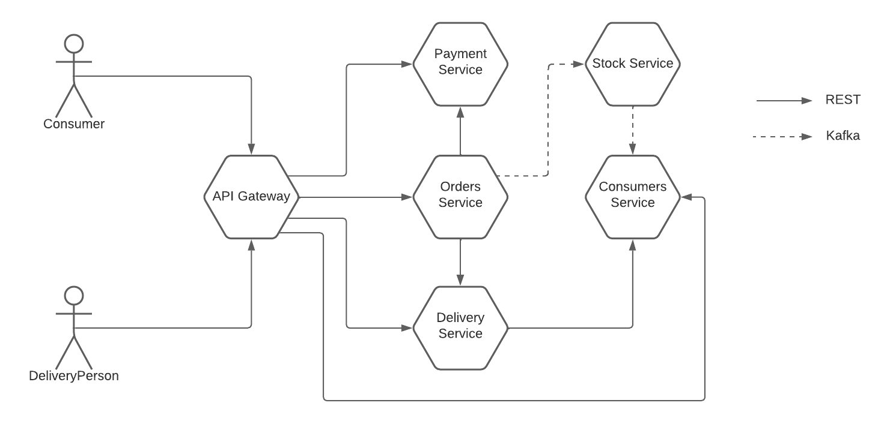

# HaaS Web Market

*HaaS* (short for "Hygiene as a Service") is a platform aimed at consumers at home expecting regular income of day-to-day products. It leverages schedulable orders, product recommendations and price drop alerts.

This project is a proposed implementation of the platform in a microservices architecture. Our team is responsible for a subsystem detailed in the following sections.

## APIs specification (OpenAPI)

All implemented endpoints are described and documented in https://haas-interaction.readme.io/, which is continuosly updated via our CI/CD pipeline.

## Architectural system design

Our subsystem is designed in a microservices architecture. Given the considerable size of the development team (the whole class) and the requisite to support a very large number of users, this allows us to achieve scalability, fault isolation and ease of development.

As expected, each microservice has its database. We are following a "domain-driven design" approach, which means that each microservice is responsible for a specific domain of the system. This allows us to achieve a high degree of cohesion and low coupling between the services. Communications between services are kept to a minimum and are mainly done asynchronously.

### Domain model

Our subsystem is responsible for orders and everything related to them. This includes the products that are ordered, the payment methods used to pay for the order, the delivery methods used to deliver the order, and the consumers who place the orders.

While we are not responsible for *Supplier*, *Product* and *Category*, these are a direct requirement for the functioning of the subsystem and are therefore included here. This means that while other subsystems may model them differently, we agreed on a common data transfer model (either through Kafka or through REST) to facilitate the integration between subsystems.

### Services architecture

We are interested in the interactions between the services that we are responsible for, and the interactions between our services and the services of other subsystems (in this diagram, the connection to the *Stock Service*).

Our services communicate as follows:

- The *Orders*, *Payments* and *Delivery* are "entry-point" services that expose a REST API to the outside world, used for creating and editing orders, paying for them and delivering them, respectively.
- The "entry-point" services communicate with the *Stock* service through Kafka, to update the stock of products.
- The *Stock* service communicates with the *Consumers* service through Kafka, to update the stock of products. The *Consumers* service caches the products to avoid unnecessary requests to the *Stock* service upon a request to a recommendation REST endpoint that it exposes.

Although not implemented, all communication instances may be logged to a database for auditing purposes, preferably asynchronously (through Kafka) to avoid performance issues.

Authentication and authorization should be handled by the API gateway. In our internal infrastructure, we assume all requests to be allowed.

## Services description and their operations

All services have been developed using Go, and each service is equipped with its own MongoDB database. Kafka is also used to enable communication through its subscribe/publish model, facilitating efficient exchange between different components of a system.

### Consumers

The *Consumers* microservice is responsible for managing the consumers of the system. Consequently, it also manages their shopping cart, registered product price drop alerts, and leverages a lightweight product recommendation system.

To allow for all product-related features, we keep a local view of the products in the system. This is updated asynchronously through Kafka, whenever a product is created or updated. This allows us to avoid unnecessary requests to the *Stock* service, which is responsible for managing the products and maintaining the actual product database.

The shopping cart is a list of products the user is interested in. It may be used by a frontend application to quickly bootstrap an order (as a result of a "checkout" operation), or simply be viewed as a wishlist. It is also useful to the recommendations infrastructure, as explained below.

The recommendations module suggests a list of products to a consumer based on their shopping cart, past orders and registered price drop alerts. The products in the local database are ordered by similarity against them. The similarity is given by factors such as category, brand and Levenshtein distance between the descriptions.

#### Key operations

- Receive product updates (creation and price updates)
- Recommend products to a consumer
- Recommend same-category products to a consumer
- List all consumers
- Get details of a specific consumer
- Delete a consumer
- Create a new consumer
- Update an existing consumer
- Register consumer for a price notification
- Get all price notifications for a consumer
- Get the consumer's shopping cart
- Add a product to the consumer's shopping cart
- Remove a product from the consumer's shopping cart

### Orders

The Order Service, a pivotal microservice, is responsible for overseeing the comprehensive order processing workflow within the system. Beyond its primary function of receiving new orders, this service plays a fundamental role in the communication with the Payment Service for order validation and with the Delivery Service to facilitate the shipment of purchases.

#### Order processing

To automate order processing, interactions with the payment and delivery services are triggered upon order creation and successful payment processing, respectively.
Finally, upon successful payment processing, is published a message in the broker to notify other services about the ordered products. This is particularly useful to update product stock.

#### Scheduled Order

In the Order Service, users have the option to reorder previous purchases through the creation of scheduled orders. This functionality allows for a convenient and efficient way to replicate and schedule orders for a more seamless ordering process. The scheduled order mirrors a regular one, differing only in a single parameter: the number of days between each reorder. 
Finally, the service incorporates a chronological job, operating on a separate thread, which periodically checks for new orders to be created. 

To facilitate the management of each order, there are 5 different states to control the process flow:

- PENDING
  - Represents the initial state when an order is created but payment processing has not occurred.
- AUTHORIZED 
  - Indicates that the payment has been successfully processed, but the order has not yet been shipped.
- SHIPPED    
  - Marks the state when the delivery service has accepted the order for shipment.
- DELIVERED
  - Confirm that the order has been successfully delivered to the customer.
- CANCELLED  
  - Allows users to cancel the order, but only if the order is PENDING.

#### Key operations

- Create a new order.
- Update an existing order.
- Publish a message in the broker to alert other services about the ordered products.
- Retrieve a specific order by its unique identifier.
- Retrieve a list of all orders associated with a specific client.
- Retrieve a list of all orders.
- Communication between services to ensure the correct processing of orders.

### Delivery

Our *Delivery* service is by design a very simple service. Since the *Haas Web Market* system does not focus on real-time delivery (i.e. is not a delivery company such as Uber Eats), we leverage only infrastructure for delivering an order at a location, and we provide an estimated delivery time, without real-time tracking.

#### Key operations

- Get the delivery status for an order
- Request delivery for an order
- Mark an order as delivered

### Payments

The Payments service plays a crucial role in validating each order's payment. To simulate real-world scenarios, a mock service has been implemented, wherein payment data is validated, and a 20% chance of failure is introduced to emulate potential issues.

#### Key operations

- Validation of order payments

## Resilience Patterns

The microservices architecture is a distributed system, which means that it is prone to failures. Despite this, it is straightforward to deploy them to a resilient infrastructure such as Kubernetes, which allows us to achieve high availability and fault tolerance, by automatically handling failures and scaling the system as needed.

Besides this, we implemented a few resilience patterns to further improve the robustness of our system.

### Statelessness

Our *Payments* microservice does not store any local data (in a real-world scenario, it would simply communicate with a payments provider). This "pure" nature allows us to easily scale the service horizontally, and to easily recover from failures, by simply restarting the service.

### Data partitioning

Our *Consumers* microservice holds a local view of the products in the system. This allows us to avoid unnecessary requests for the _Stock_* service, but also to serve as a backup in case the *Stock* service is unavailable. This is a form of data partitioning, which allows us to achieve fault tolerance.

## Observability patterns

In a microservices system, it is important to have a way to monitor the health of the system and to be able to debug it in case of failures. In our system, the *API Gateway subsystem* is the main responsible for the latter. In the following subsections, we briefly describe the observability patterns that we implemented.

### Health check

All microservices provide a health check endpoint, which may be used by the *API Gateway subsystem* or any other external master node (e.g. the Kubernetes control panel) to determine if the service is healthy. This is done by simply checking if the service is running. If it is not, the service may be restarted or replaced.

### Tracing

As explained above, we did not implement any communication announcement to any Kafka topic, which would be useful for distributed tracing. However, we did implement a simple local logging system in the form of tracing middleware. A control panel may be implemented to allow for easy access to the logs, for example, via SSH and an inspection of the logs tail. A simple concatenation of the logs of all services may be used to achieve a global view of the system.

## Security implementation

We rely on the API gateway functionality to ensure all incoming requests to our services are properly authenticated and authorized, which should render the attack surface small, for starters. Although not implemented as of now, we see signing requests with assymetric keys as desirable future work to raise trust inside our infrastructure.

On top of this, we use *GoSec*, a static source code analyzer that checks for common issues such as DoS vulnerabilities, hardcoded credentials or out of bounds accesses. It has helped to solve code smells that could lead to service denials or data exploitation in extreme edge cases.

## Deployment
To ease building and deploying our services, we containerized them. This allows for seamless integration of new versions. We leverage CI/CD pipelines (both on our GitHub and GitLab repositories) to automatically analyze code and build and deploy new versions of our services to the image registry.

The services are hosted in Azure with the [container apps service](https://azure.microsoft.com/en-us/products/container-apps/) that uses Kubernetes under the hood. This allows us to easily scale the services horizontally and to achieve high availability and fault tolerance. [MongoDB Atlas](https://www.mongodb.com/atlas) is used to host the databases of each service.

Ideally our services would only be accessed through an API gateway, which should log requests and handle authentication and authorization. However, due to time constraints and for simplicity sake, we expose the services directly to the internet. Reconfiguring the services to only accept requests from the API gateway is trivial and should be done in a real-world scenario.

## Conclusion

Our subset of *HaaS* is as of now a reliable subsystem that fullfills the initial base requirements (MVP) and is thus able to be shipped. We also pointed out future work, such as security enhancements, that we feel will improve the quality of the product further in the future.